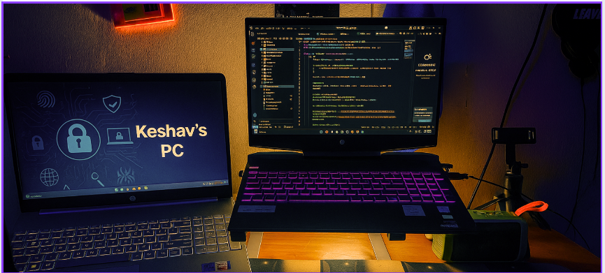

<!-- Profile  Banner -->

  

<!-- Quotation -->
<h2 align="center">
  
</h2>

### 👨‍💻 About Me  

- 🎓 I am a **Computer Science Engineering student** passionate about **Web Development**, **Data Structures & Algorithms**, and **System Design**.  
- 📍 Based in **Bangalore, India**.  
- 🌱 Currently deepening my skills in **Web Development** and **DSA**.  
- 💡 Built projects such as a **Real-Time Chat App** , **JARVIS AI assistant** and many more .
- 🚀 Exploring opportunities in **internships and placements**.  

<!-- Portfolio Link -->

  

---
### ⚒️ Skills & Tools  

  <!-- Web & Frontend -->
  
  
  
  
  
  

  <!-- Backend & Databases -->
  
  
  
  
  
  

  <!-- DevOps & Hosting -->
  
  
  
  

  <!-- Programming Languages -->
  
  
  
  

  <!-- Concepts -->
  

